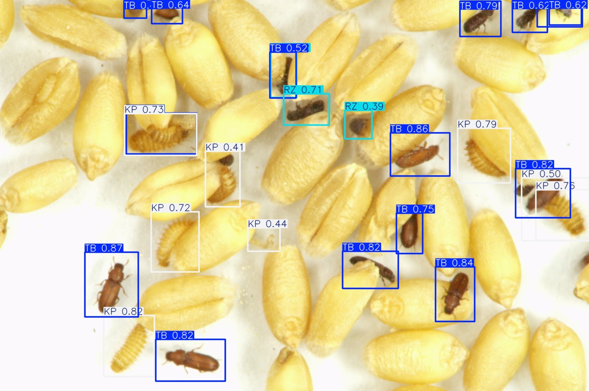

# Density-Stratified Generalization for Stored-Product Pest Detection

This repository is the reproducibility companion for a YOLOv11s study of tiny stored-product pest detection under scene-density shift. It packages the study code without datasets, trained weights, or machine-specific paths.

The experiments address three questions:

1. Does density-stratified partitioning provide a more realistic estimate of detector generalization than a conventional random split for sequentially captured images?
2. How do Ghost Convolution (GC), DySample (DS), and Focal-EIoU (FE) affect detection across free and concentrated scene-density domains?
3. Does feature recalibration after the YOLOv11 C2PSA block improve robustness under density shift?

The target classes are:

| ID | Code | Species and life stage |
| --- | --- | --- |
| 0 | TB | *Tribolium castaneum*, adult |
| 1 | RZ | *Rhyzopertha dominica*, adult |
| 2 | KP | *Trogoderma granarium* (Khapra beetle), larva |

## Repository Contents

| Path | Purpose |
| --- | --- |
| `patches/ultralytics.patch` | Clean Ultralytics integration for DySample, EMA, ECA, attention YAML parsing, and opt-in Focal-EIoU |
| `configs/models/` | YOLOv11s architectural variants used by the ablation and attention studies |
| `configs/datasets/` | Portable dataset YAML templates |
| `docs/integration_notes.md` | File-level explanation of the Ultralytics patch and model-selection flow |
| `docs/component_citations.md` | Original method attribution and manuscript citation guidance |
| `docs/references.bib` | Ready-to-import BibTeX references for integrated components |
| `CITATION.cff` | GitHub-compatible repository citation metadata |
| `scripts/train.py` | Reproducible training entry point |
| `scripts/evaluate.py` | Evaluation metrics and timing in milliseconds per image and FPS |
| `scripts/infer_video.py` | Annotated video inference for qualitative demonstrations |
| `scripts/analyze_scene_density.py` | Scene density, occupancy, nearest-neighbor concentration, CSV summaries, and publication plots |
| `scripts/create_random_split.py` | Random 80:20 train-validation partition for the leakage comparison |
| `scripts/analyze_leakage.py` | Cross-split exact-hash, perceptual-hash, SSIM, and annotation-overlap audit |
| `scripts/visualize_gradcam.py` | Grad-CAM comparison panels from a model manifest |
| `scripts/visualize_detections.py` | Qualitative detection panels from a model manifest |

## Setup

The integration is pinned to Ultralytics commit `eec4148e7b976cbbe1378aeee03f52337c79479e`.

```bash
python -m venv .venv
source .venv/bin/activate
pip install -r requirements.txt
bash scripts/apply_ultralytics_patch.sh
export PYTHONPATH="$PWD/vendor/ultralytics:$PYTHONPATH"
```

The setup script clones the pinned Ultralytics source into `vendor/ultralytics` and applies the integration patch. The patch preserves baseline CIoU behavior. Focal-EIoU is enabled only when `--bbox-loss focal_eiou` is passed to training.

`ffmpeg` with a `libx264` or `libopenh264` encoder is also required when regenerating the browser-compatible qualitative demo video.

## How It Works

1. `scripts/apply_ultralytics_patch.sh` clones the pinned Ultralytics source into the ignored `vendor/ultralytics/` directory and applies `patches/ultralytics.patch`.
2. The patch adds DySample, EMA, ECA, attention-module parsing, and opt-in EIoU or Focal-EIoU regression while preserving CIoU as the default baseline loss.
3. The YAML files in `configs/models/` select the architectural variant. The `--bbox-loss` training argument selects the regression objective separately, allowing the same model YAML to be reused for CIoU and Focal-EIoU ablations.
4. Dataset YAML files point to local YOLO-format images and labels. Datasets and trained weights are excluded from Git so that the repository remains a portable code companion rather than a data archive.
5. `scripts/train.py` trains a selected variant, `scripts/evaluate.py` measures independent-domain performance, and the analysis scripts regenerate scene-density summaries, leakage audits, comparison plots, Grad-CAM panels, and qualitative detections.

## Dataset Layout

Place local data under `data/` or pass explicit paths to the scripts. See [docs/dataset_layout.md](docs/dataset_layout.md). Dataset images and annotations are intentionally excluded from Git.

## Core Experiments

Train the density-stratified baseline:

```bash
python scripts/train.py \
  --model yolo11s.pt \
  --data configs/datasets/density_development.example.yaml \
  --name yolo11s_density_baseline
```

Train the modified GC + DS + FE model:

```bash
python scripts/train.py \
  --model configs/models/yolo11s_ghost_dysample.yaml \
  --data configs/datasets/density_development.example.yaml \
  --bbox-loss focal_eiou \
  --name yolo11s_ghost_dysample_focal_eiou
```

Evaluate on the two independent mixed-species domains:

```bash
python scripts/evaluate.py --weights weights/best.pt --data configs/datasets/test_free.example.yaml
python scripts/evaluate.py --weights weights/best.pt --data configs/datasets/test_conc.example.yaml
```

Characterize density shift:

```bash
python scripts/analyze_scene_density.py \
  --dataset configs/experiments/density_splits.example.yaml \
  --output-dir outputs/density_analysis
```

Regenerate metric heatmaps:

```bash
python scripts/plot_result_heatmaps.py
```

## Qualitative Demo

[View or download the YOLOv11s + CBAM mixed-scene detection video](docs/assets/yolo11s_cbam_mixed_scene_demo.mp4).

[](docs/assets/yolo11s_cbam_mixed_scene_demo.mp4)

The demo uses the standalone CBAM attention variant reported in the attention study. GitHub may download repository-hosted videos instead of previewing them inline. The video is a qualitative illustration, not a substitute for the independent test-set metrics.

Regenerate a video with a local checkpoint:

```bash
python scripts/infer_video.py \
  --weights weights/yolo11s_cbam.pt \
  --source data/demo/mixed_scene.mp4 \
  --output outputs/yolo11s_cbam_mixed_scene_demo.mp4
```

Create the random 80:20 comparison split:

```bash
python scripts/create_random_split.py \
  --source data/density_development \
  --output data/random_80_20 \
  --seed 42
```

## Reproducibility Notes

- Images are resized to `640 x 640`.
- Training defaults reproduce the study configuration: 300 epochs, batch size 16, AdamW, cosine learning-rate decay, and mosaic disabled during the final 10 epochs.
- Augmentation is applied to training images only. Validation and test images are not augmented.
- The reported FPS values are throughput estimates derived from Ultralytics milliseconds-per-image timings. Use repeated runs on the same hardware for comparative latency claims.
- The repository uses AGPL-3.0 because it distributes a patch against Ultralytics AGPL-3.0 source.

See [docs/reproducibility.md](docs/reproducibility.md) for the experiment matrix and metric definitions.
The locally inspected environment is recorded in [docs/environment.md](docs/environment.md); confirm it matches the final experiment machine before manuscript submission.

## Component Citations

The repository integrates established methods rather than claiming them as new modules. Cite their original papers when describing Ghost Convolution, DySample, Focal-EIoU, EMA, CBAM, ECA, standalone Channel Attention, and the supporting visualization, audit, and augmentation methods. See [docs/component_citations.md](docs/component_citations.md) and import [docs/references.bib](docs/references.bib) into the manuscript bibliography.

## License and Attribution

This project integrates code from [Ultralytics YOLO](https://github.com/ultralytics/ultralytics), which is licensed under [AGPL-3.0](https://github.com/ultralytics/ultralytics/blob/main/LICENSE). This repository distributes the corresponding integration patch and is also released under AGPL-3.0. See [docs/integration_notes.md](docs/integration_notes.md) for the patch scope and [LICENSE](LICENSE) for the full license text.

The repository includes `CITATION.cff` so GitHub can expose the repository citation panel.
